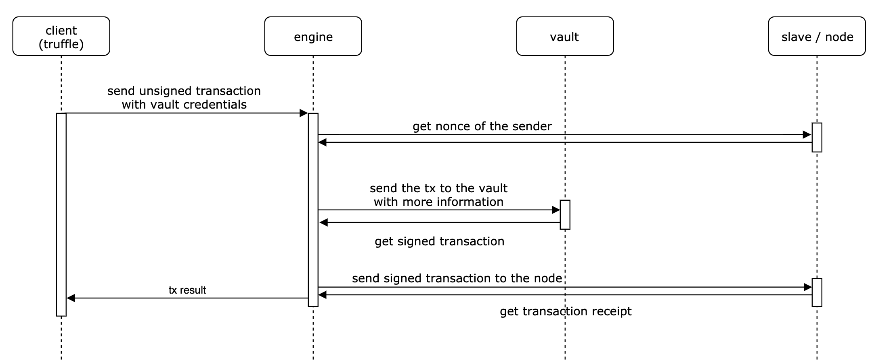

# Tell me more about Vault features

### What is a vault ?

A Vault is a tool powered for the storing, managing and accessing secrets. In our case, Rocskside can use a vault for handling private keys.

### Why use a vault ?

The best way to protect a private keys is to store them in one place and never share them or expose them directly to the outside world. Vaults provides such features for your private keys, insuring that only people with the right access can you use but can't have it in clear.

### Which vaults are compatible with Rockside ?

Rockside is using [Hashicorp Vault](https://www.vaultproject.io/) solution. We developed an open-source plugin for Hashicorp Vault that enabled transactions signing inside it. That way your users only send unsigned transactions with their vault credentials, and they get back signed transactions.

The best way to understand and mastering Vault is by reading [the official Vault documentation](https://www.vaultproject.io/docs/).

### How to configure the vault ?

Policies are not handled by the plugin or by Rockside. It is the client's responsibility to configure them and affect them to theirs users.

See [the official Vault documentation](https://www.vaultproject.io/docs/concepts/policies.html).

### Hashicorp Vault installation

See [the official Vault documentation](https://learn.hashicorp.com/vault/getting-started/install).

### Rockside Hashicorp Vault plugin installation & start

The purpose of this plugin is to provide the vault with a connector to the rockside engine and some features to manage Ethereum account.

For more details and install process, see the readme on the [project github](https://github.com/blockchain-studio/rockside-hashicorp-vault-plugin).

After that you need to connect your engine to the vault.

Edit **~/.rockside/engine/rockside.env** and add:

```
VAULT_HOST=<YOUR_VAULT_ADDRESS>/v1/rockside/
```

Relaunch Engine with new configuration:
```
sudo rockside engine reconfigure
```

### Storing private keys

#### create an account

```sh
vault write -f rockside/keys/new
```

#### import an account

```sh
vault write -f rockside/keys/import private_key="f5a200fea608820dc411bc212ff4ec76d331e6efd39ac1bf30aca066fb3c6807"
```

#### list accounts

```sh
vault list rockside/keys
```

#### read an account (and get its private key)

```sh
vault read rockside/keys/0x62b1d469a3ae3bb5669ea69c933bb1649ff02439
```

### Policies creation

#### policy for accounts creation

```sh
vault policy write account_creator -<<EOF
path "rockside/keys/new" {
  capabilities = ["create"]
}
path "rockside/keys/import" {
  capabilities = ["create"]
}
EOF
```

#### policy for transactions signing

On all accounts

```sh
vault policy write all_signer -<<EOF
path "rockside/sign-tx/*" {
  capabilities = ["create"]
}
EOF
```

On a specific account

```sh
vault policy write unique_signer -<<EOF
path "rockside/sign-tx/0x62b1d469a3ae3bb5669ea69c933bb1649ff02439" {
  capabilities = ["create"]
}
EOF
```

#### policy reading accounts

On all accounts

```sh
vault policy write all_reader -<<EOF
path "rockside/keys/*" {
  capabilities = ["read"]
}
EOF
```

On a specific account

```sh
vault policy write unique_reader -<<EOF
path "rockside/keys/0x62b1d469a3ae3bb5669ea69c933bb1649ff02439" {
  capabilities = ["read"]
}
EOF
```

#### create a token for a policy

```sh
vault token create -policy=<policy name>
```

This token allows you to connect to the vault and have access to all the route accessible with the associated policy.

### Example with truffle

First generate an account. You will need to transfert some ether to that address.

```sh
vault write -f rockside/keys/new
# return the address: 0xabcdef00000000000000000000000000000000000
```

Create a policy for this account

```sh
vault policy write example -<<EOF
path "rockside/sign-tx/0xabcdef00000000000000000000000000000000000" {
  capabilities = ["create"]
}
EOF
```

Derivate a token from this policy

```sh
vault token create -policy=example
# return the token: supertoken
```

Add the address and the token in your truffle.js. You will also need a node up.

```sh
var Web3 = require("web3");

module.exports = {
    networks: {
        development: {
            provider: function() {
                return new Web3.providers.HttpProvider('http://localhost:8080/api/nodes/rpc/<node token>/supertoken');
            },
            network_id: "*",
            from: "0xabcdef00000000000000000000000000000000000",
        },
    }
}
```

Then launch truffle.

```sh
truffle migrate
```

And that's it ! You just sended an unsigned tx with your vault token, the vault has identified you and signed the tx with the good privatekey and then the tx was sent to the network. Keep in mind that the privatekey was never exposed.

### Process of the solution



<!--- COMMENTED FOR LATER
### Which authentication provider is supported ?

We provide an javascript sdk for github authentification but you have to configure it in your vault first.
See [the official Vault documentation](https://www.vaultproject.io/docs/auth/github.html).

### Github identity provider configuration
You will need a github personal access token. If your not sure on how to get one look at the [official Vault documentation](https://www.vaultproject.io/docs/auth/github.html).

#### Vault config

```sh
# enable github auth
vault auth enable github

# link your github org to the vault
vault write auth/github/config organization=YOUR_ORG_GIT

# create a policy linked to an address
vault policy write POLICY_NAME -<<EOF
path "rockside/sign-tx/ADDRESS" {
  capabilities = ["create"]
}
EOF

# link the policy to a team of your github org
vault write auth/github/map/teams/GIT_TEAM value=sign-policy
```

#### sdk config

Create a file `rockside_sdk.js`.

```sh
touch rockside_sdk.js
```

And put this inside.

```js
const request = require('sync-request');
const VAULT_AUTH_PATH= '/v1/auth/github/login'

// TO COMPLETE WITH YOUR VAULT ADDRESS
const VAULT_ADDR = 'http://127.0.0.1:8200'

exports.getVaultToken = function(token) {
  let res = request('POST', VAULT_ADDR + VAULT_AUTH_PATH, {
    json: {token: token},
  });
  return JSON.parse(res.getBody('utf8')).auth.client_token;
}
```


#### truffle config

Edit `truffle-config.js` and put this instead.

```js
const Web3 = require('web3');
const rockside_sdk = require('./rockside_sdk');
let VAULT_TOKEN = ''

// TO COMPLETE WITH YOUR INFORMATION
const RPC_PROVIDER = 'YOUR_RPC_PROVIDER'
const SENDER = 'YOUR_ADDRESS'
const GITHUB_TOKEN = 'YOUR_GITHUB_TOKEN'

module.exports = {
  networks: {
    development: {
      provider: () => {
        if (VAULT_TOKEN == '') {
          VAULT_TOKEN = rockside_sdk.getVaultToken(GITHUB_TOKEN);
        }
        return new Web3.providers.HttpProvider(RPC_PROVIDER + '/' + VAULT_TOKEN)
      },
      from: SENDER,
      network_id: '*',
    },
  },
}
```

#### install dependencies

```sh
npm install web3 -s
npm install sync-request -s
```

#### run truffle

```sh
truffle migrate
```
--->

